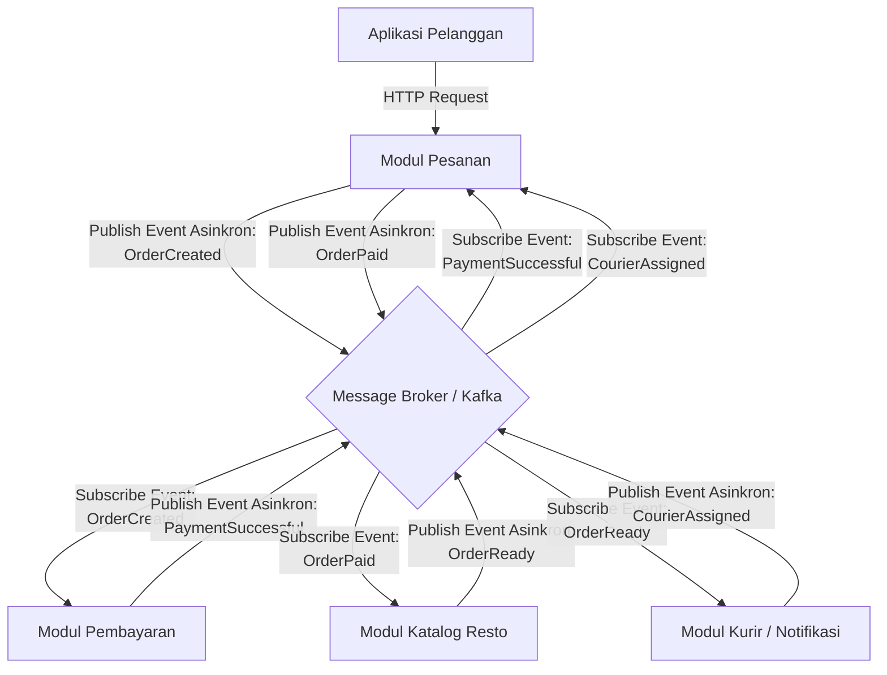

# Jurnal Proses — Tugas 2

## 23 September 2026
- Opsi arsitektur yang dipertimbangkan:
- Andi Athallah Radja : saya mempertibangkan untuk menggunakan arsitektur Pub-Sub karena dari hasil analisis sebelumnya ditemukan bahwa ada masalah pada modul pembayaran yang menunggu tanpa batas waktu dengan menggunakan Pub-sub masalah ini bisa dieliminasi karena penggunaan sistem Asynchronous Decoupling yang dimana nantinya akan ada decoupling space dan decoupling time yang membuat modul pemesanan tidak perlu tahu ip port atau api dari modul pembayaran yang dibutuhkan cuma alamat message broker
- Calvin Immanuel Lado: saya mempertimbangkan penggunaan kombinasi arsitektur SOA dan Pub-Sub. SOA digunakan untuk memisahkan modul utama FoodGo seperti modul pesanan, pembayaran, katalog resto, dan kurir/notifikasi menjadi service yang berdiri sendiri. Dengan pemisahan tersebut, setiap service dapat dikembangkan dan di-deploy secara independen tanpa harus me-restart seluruh sistem. Pub-Sub digunakan untuk komunikasi yang bersifat asynchronous, terutama untuk proses yang tidak membutuhkan respon langsung seperti pembayaran berhasil, pesanan diterima restoran, makanan selesai dipersiapkan, dan kurir ditugaskan.

   
- Kenapa akhirnya pilih [SOA/Pub-Sub]:
- Calvin Immanuel Lado: Saya memilih kombinasi SOA dan Pub-Sub karena masalah utama pada arsitektur FoodGo sebelumnya adalah tingginya coupling antar modul. Semua modul masih berada dalam satu aplikasi monolitik sehingga ketika salah satu modul diperbarui atau di-deploy ulang, modul lainnya juga ikut terdampak.
- Revisi diagram 
- Draft Diagram 1 dari Andi Athallah radja
  ```mermaid
  graph TD
      Client[Aplikasi Pelanggan] -->|HTTP Request| OrderSvc[Modul Pesanan]
      
      Broker{Message Broker / Kafka}
      
      OrderSvc -->|Publish Event Asinkron:<br>OrderCreated| Broker
      
      Broker -->|Subscribe Event:<br>OrderCreated| PaySvc[Modul Pembayaran]
      PaySvc -->|Publish Event Asinkron:<br>PaymentSuccessful| Broker
      
      Broker -->|Subscribe Event:<br>PaymentSuccessful| RestoSvc[Modul Katalog Resto]
      RestoSvc -->|Publish Event Asinkron:<br>FoodBeingPrepared| Broker
      
      Broker -->|Subscribe Event:<br>FoodBeingPrepared| CourierSvc[Modul Kurir / Notifikasi]
  ```
- Draft Diagram 1 revisi dari Calvin Immanuel Lado
  - PaymentSuccessful tidak langsung diteruskan ke Modul Katalog Resto, tetapi terlebih dahulu diterima Modul Pesanan.
  - Modul Pesanan menambahkan event baru `OrderPaid`.
  - Event `FoodBeingPrepared` diubah menjadi `OrderReady`.
  - Ditambahkan event `CourierAssigned` dari Modul Kurir/Notifikasi.
  - `CourierAssigned` diteruskan kembali ke Modul Pesanan agar status kurir dapat diperbarui.
  - Revisi dilakukan agar alur lebih lengkap dan menunjukkan proses end-to-end sampai kurir ditugaskan.


    

## Log Penggunaan AI (Level 2)

> Wajib diisi sesuai kebijakan Level 2 di [`../RUBRIK-UMUM.md`](../RUBRIK-UMUM.md). Tulis "Tidak memakai AI" pada baris pertama jika memang tidak dipakai. Hanya untuk brainstorming ide/outline — bukan untuk kode/analisis/teks akhir.

| Tanggal | Tool AI | Prompt yang diberikan | Ringkasan saran/ide AI | Bagaimana diolah jadi tulisan/kode sendiri |
|---|---|---|---|---|
| 23 September 2026 | Antigravity (Gemini) |  "mari kita eksplor ke opsi Publish Subscribe, jelaskan secara detail dulu |AI menjelaskan konsep *Event-Driven Architecture* menggunakan Message Broker, memberikan contoh alur *end-to-end* (Pesanan → Broker → Pembayaran → Kurir), dan menjelaskan kenapa Pub-Sub mengatasi *coupling* (spatial & temporal). AI juga memberikan contoh *draft* diagram Mermaid. |  Saya memahami konsep isolasinya dan menyimpulkan sendiri bahwa Pub-Sub memungkinkan skalabilitas mandiri dan mencegah *crash* beruntun. |
