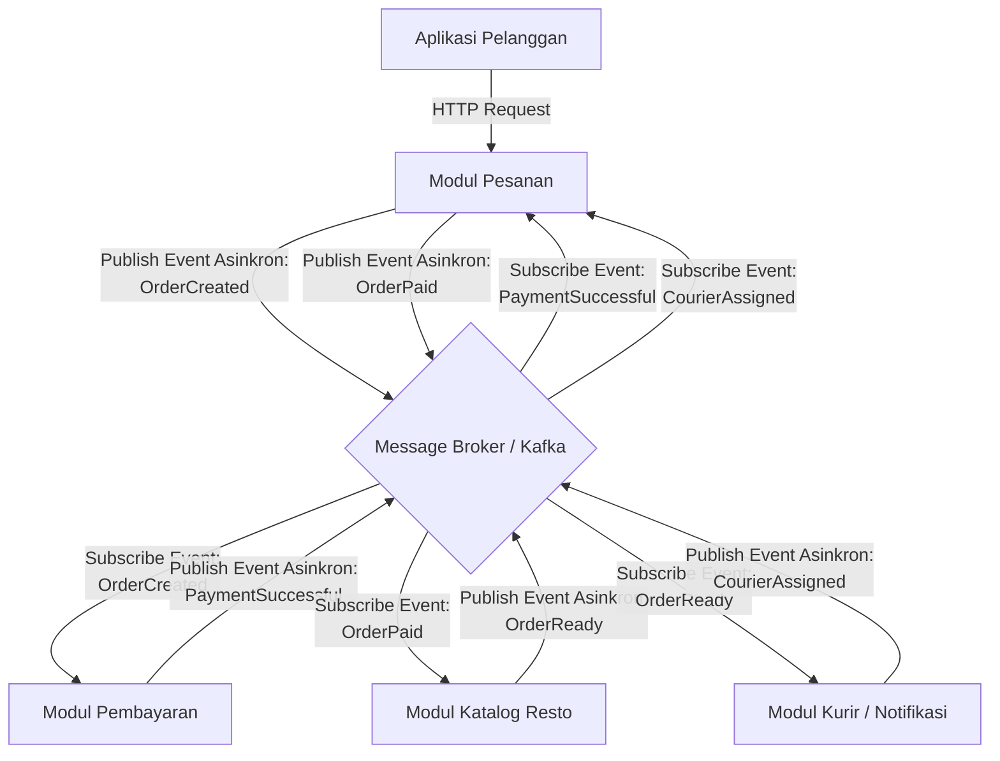

# Jurnal Proses — Tugas 2

**Kelompok:** INTERCOROPS

| Nama | NIM | Kontribusi |
|---|---|---|
| [ANDI ATHALLAH RADJA] | 103072400034 | Pemilihan Opsi Arsitektur, pembuatan alur skenario diagram, pengumpulan tugas pada git |
| [KRISNA PUTRA WICAKSANA] | 103072400079 | Pemilihan Opsi Arsitektur, menggambarkan komponen dan interaksinya,  |
| [CALVIN IMMANUEL LADO] | 103072400158 | Pemilihan Opsi Arsitektur, Pembuatan dan menjelaskan alur skenario diagram |

## 23 September 2026
## Opsi arsitektur yang dipertimbangkan:
- Andi Athallah Radja : saya mempertibangkan untuk menggunakan arsitektur Pub-Sub karena dari hasil analisis sebelumnya ditemukan bahwa ada masalah pada modul pembayaran yang menunggu tanpa batas waktu dengan menggunakan Pub-sub masalah ini bisa dieliminasi karena penggunaan sistem Asynchronous Decoupling yang dimana nantinya akan ada decoupling space dan decoupling time yang membuat modul pemesanan tidak perlu tahu ip port atau api dari modul pembayaran yang dibutuhkan cuma alamat message broker
- Calvin Immanuel Lado: saya mempertimbangkan penggunaan gabungan antara arsitektur SOA dan model Pub-Sub. SOA digunakan untuk memisahkan modul utama FoodGo seperti modul pesanan, pembayaran, katalog restoran, dan kurir/notifikasi menjadi layanan yang mandiri. Dengan pemisahan tersebut, setiap layanan bisa dikembangkan dan dijalankan sendiri tanpa perlu menghentikan seluruh sistem. Pub-Sub digunakan untuk berkomunikasi secara asynchronous, khususnya untuk proses yang tidak membutuhkan jawaban langsung, seperti notifikasi pembayaran berhasil, pesanan diterima oleh restoran, makanan telah selesai dipersiapkan, dan kurir sudah ditugaskan.
- Krisna Putra Wicaksana: Saya mempertimbangkan kombinasi SOA dan Publish-Subscribe. Menurut saya, SOA saja tidak cukup untuk mengatasi masalah yang ditemukan, karena walaupun modul sudah dipisah, jika komunikasinya tetap sinkron dan langsung antar-service, modul yang satu masih bisa ikut terganggu ketika modul lain lambat atau down ini persis masalah pembayaran yang menunggu tanpa batas waktu itu. Karena itu, SOA di desain ini saya batasi perannya hanya untuk memisahkan modul jadi layanan mandiri yang bisa di-deploy terpisah, bukan untuk komunikasinya. Semua komunikasi antar-modul, termasuk pemesanan dan pembayaran, tetap dibuat asinkron lewat Pub-Sub kepastian hasilnya dijaga lewat urutan event yang jelas (OrderCreated → PaymentSuccessful → OrderPaid) dan status yang selalu dikonfirmasi balik ke Modul Pesanan, bukan lewat menunggu response langsung. Menurut saya kombinasi ini paling seimbang antara kemudahan mengatur struktur layanan dan menghindari coupling yang jadi masalah utama di arsitektur monolitik sebelumnya, tanpa memunculkan kembali risiko "menunggu tanpa batas waktu" yang ingin dihindari sejak awal.
   
- Kenapa akhirnya pilih SOA + Pub-Sub:
Kombinasi ini dipilih karena SOA saja belum cukup mengatasi masalah walaupun modul sudah dipisah, jika komunikasinya tetap sinkron dan langsung antar-service, satu modul masih bisa ikut terdampak saat modul lain lambat atau down. Di sisi lain, Pub-Sub saja juga kurang tepat untuk semua proses, karena ada bagian yang tetap butuh kepastian urutan dan hasil, seperti pemesanan dan pembayaran. Dengan menggabungkan keduanya: SOA menjaga tiap modul FoodGo (Pesanan, Pembayaran, Katalog Resto, Kurir) tetap independen dan bisa di-deploy terpisah, sementara Pub-Sub menghilangkan ketergantungan langsung antar-modul (termasuk masalah modul pembayaran yang bisa menunggu tanpa batas waktu) dengan membuat seluruh alur pesanan berbasis event lewat message broker.

- Revisi diagram 
- Draft Diagram 1 dari Andi Athallah radja
  ```mermaid
  graph TD
      Client[Aplikasi Pelanggan] -->|HTTP Request| OrderSvc[Modul Pesanan]
      
      Broker{Message Broker / Kafka}
      
      OrderSvc -->|Publish Event Asinkron:<br>OrderCreated| Broker
      
      Broker -->|Subscribe Event:<br>OrderCreated| PaySvc[Modul Pembayaran]
      PaySvc -->|Publish Event Asinkron:<br>PaymentSuccessful| Broker
      
      Broker -->|Subscribe Event:<br>PaymentSuccessful| RestoSvc[Modul Katalog Resto]
      RestoSvc -->|Publish Event Asinkron:<br>FoodBeingPrepared| Broker
      
      Broker -->|Subscribe Event:<br>FoodBeingPrepared| CourierSvc[Modul Kurir / Notifikasi]
  ```
- Draft Diagram 2 revisi dari Calvin Immanuel Lado
  - PaymentSuccessful tidak langsung diteruskan ke Modul Katalog Resto, tetapi terlebih dahulu diterima Modul Pesanan.
  - Modul Pesanan menambahkan event baru OrderPaid.
  - Event FoodBeingPrepared diubah menjadi OrderReady.
  - Ditambahkan event CourierAssigned dari Modul Kurir/Notifikasi.
  - CourierAssigned diteruskan kembali ke Modul Pesanan agar status kurir dapat diperbarui.
  - Revisi dilakukan agar alur lebih lengkap dan menunjukkan proses end-to-end sampai kurir ditugaskan.


    

## Log Penggunaan AI (Level 2)

> Wajib diisi sesuai kebijakan Level 2 di [`../RUBRIK-UMUM.md`](../RUBRIK-UMUM.md). Tulis "Tidak memakai AI" pada baris pertama jika memang tidak dipakai. Hanya untuk brainstorming ide/outline — bukan untuk kode/analisis/teks akhir.

| Tanggal | Tool AI | Prompt yang diberikan | Ringkasan saran/ide AI | Bagaimana diolah jadi tulisan/kode sendiri |
|---|---|---|---|---|
| 23 September 2026 | Antigravity (Gemini) |  "mari kita eksplor ke opsi Publish Subscribe, jelaskan secara detail dulu |AI menjelaskan konsep *Event-Driven Architecture* menggunakan Message Broker, memberikan contoh alur *end-to-end* (Pesanan → Broker → Pembayaran → Kurir), dan menjelaskan kenapa Pub-Sub mengatasi *coupling* (spatial & temporal). AI juga memberikan contoh *draft* diagram Mermaid. |  Saya memahami konsep isolasinya dan menyimpulkan sendiri bahwa Pub-Sub memungkinkan skalabilitas mandiri dan mencegah *crash* beruntun. |
| 23 Sep 2026 | Chat GPT | Apa peluang dan kekurangan SOA dan Publish-Subscribe, serta bagaimana keduanya dapat saling melengkapi? | AI menjelaskan bahwa SOA unggul dalam pemisahan service, modularitas, deployment independen, dan scaling, tetapi masih dapat memiliki coupling tinggi jika service terlalu banyak saling memanggil secara langsung. Pub-Sub unggul dalam komunikasi asynchronous dan loose coupling, tetapi memiliki tantangan pada debugging, keterlambatan event, event duplikat, dan konsistensi data. Keduanya dapat dikombinasikan dengan SOA sebagai struktur utama service dan Pub-Sub sebagai mekanisme komunikasi event. | Membandingkan kelebihan dan kekurangan kedua pendekatan, lalu menentukan bahwa SOA digunakan untuk memisahkan modul utama FoodGo menjadi service independen. Pub-Sub digunakan pada proses yang tidak membutuhkan respons langsung.|
| 23 Sep 2026 | GPT | Dari studi kasus FoodGo yang membutuhkan sistem decoupled, apakah memungkinkan menggunakan kombinasi SOA dan Publish-Subscribe? | AI menjelaskan bahwa SOA dan Pub-Sub dapat dikombinasikan. SOA dapat digunakan untuk memisahkan fungsi utama FoodGo menjadi service yang independen, sedangkan Pub-Sub digunakan untuk komunikasi berbasis event yang bersifat asynchronous antarservice. | Mempelajari perbedaan fungsi SOA dan Pub-Sub, kemudian menentukan SOA sebagai dasar pemisahan service dan Pub-Sub untuk komunikasi event yang tidak membutuhkan respons langsung. Konsep tersebut lalu diterapkan pada rancangan arsitektur FoodGo.|
| 23 Sep 2026 | Claude | Apakah seluruh komunikasi dalam skenario FoodGo sebaiknya menggunakan komunikasi asinkron? | AI menyarankan agar tidak semua komunikasi dipaksakan asinkron. Request awal dari pelanggan dapat tetap menggunakan HTTP request-response, sementara komunikasi antar-service dapat menggunakan event melalui broker. | Saya menerapkan pembagian tersebut pada diagram. Pelanggan → Order Service menggunakan komunikasi sinkron, sedangkan komunikasi antar-service menggunakan event asinkron melalui message broker. |
| 23 Sep 2026 | Claude | Aku kepikiran menggabungkan SOA dengan Pub-Sub. Apa kelebihan dan kekurangan dari pendekatan kombinasi ini kalau diterapkan pada FoodGo? | AI mengarahkan diskusi pada kelebihan berupa pemisahan service dan pengurangan coupling, serta kekurangan seperti kompleksitas debugging dan eventual consistency. | Saya memilih poin yang paling relevan dengan kasus FoodGo dan mengembangkannya menjadi alasan pemilihan kombinasi SOA + Pub-Sub. |
