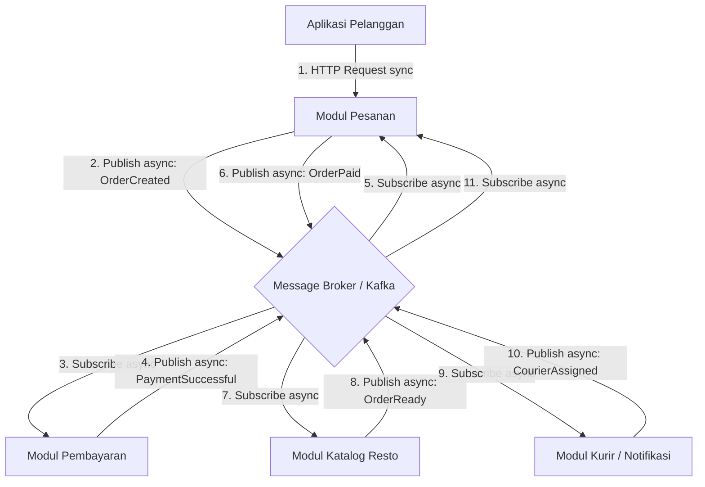

# Tugas 2 (Pekan 2) — Perancangan Arsitektur untuk FoodGo

**Materi terkait:** Architectural style (Layered, SOA, Peer-to-Peer, Publish-Subscribe).

## Studi Kasus

Melanjutkan Tugas 1: FoodGo butuh sistem yang **decoupled** agar tim kurir dan tim resto tidak saling mengganggu ketika salah satu modul diperbarui/deploy ulang. Saat ini semua modul (pesanan, pembayaran, notifikasi kurir, katalog resto) berjalan sebagai satu aplikasi monolitik — sekali deploy, semua modul ikut restart dan berisiko downtime total.

## Gaya arsitektur yang dipilih.
Kombinasi: Service-Oriented Architecture (SOA) + Publish-Subscribe (Pub-Sub)

SOA berperan di level pemisahan modul/layanan: Pesanan, Pembayaran, Katalog Resto, dan Kurir/Notifikasi masing-masing menjadi service mandiri dengan tanggung jawab jelas, yang bisa di-deploy dan diskalakan secara terpisah (poin Calvin).
Pub-Sub berperan di level komunikasi antar-layanan tersebut: seluruh interaksi setelah pesanan dibuat konfirmasi pembayaran, notifikasi ke resto, sampai penugasan kurir dilakukan lewat event yang dipublish dan disubscribe lewat message broker, bukan lewat pemanggilan API langsung. Ini menghasilkan decoupling space (modul tidak perlu tahu IP/port/API modul lain, cukup alamat broker) dan decoupling time (publisher dan subscriber tidak harus aktif bersamaan), yang langsung mengeliminasi masalah modul pembayaran yang bisa menunggu tanpa batas waktu pada Tugas 1 (poin Raja).

Kenapa akhirnya kombinasi ini yang dipilih, bukan salah satunya saja: SOA saja belum cukup, karena walaupun modul sudah dipisah, kalau komunikasinya tetap sinkron dan langsung antar-service, satu modul masih bisa ikut terdampak ketika modul lain lambat atau down inilah persisnya masalah "menunggu tanpa batas waktu" yang ditemukan pada Tugas 1 (poin Krisna). Karena itu, di desain ini SOA sengaja hanya berperan di level pemisahan modul dan deployment, bukan di level protokol komunikasi tidak ada satu pun jalur RPC/API call sinkron antar-modul, termasuk untuk pembayaran. Kepastian hasil pembayaran tetap tercapai bukan lewat komunikasi sinkron, melainkan lewat urutan event yang eksplisit dan status yang selalu dikonfirmasi balik ke Modul Pesanan (OrderCreated → PaymentSuccessful → OrderPaid, lihat Poin 3). Dengan begitu, FoodGo tetap punya modul independen yang bisa di-deploy terpisah (dari SOA), sekaligus komunikasi antar-modulnya tidak saling terikat langsung karena berjalan lewat event di message broker (dari Pub-Sub) sehingga struktur layanan tetap teratur sekaligus coupling antar-modul, yang jadi masalah utama pada arsitektur monolitik sebelumnya, berkurang signifikan tanpa mengorbankan kepastian alur transaksi.

## Komponen dan interaksinya
1. Modul Pesanan (Order Service) : membuat pesanan dan mengelola status pesanan (dibuat, dibayar, selesai, kurir ditugaskan).
2. Modul Pembayaran (Payment Service) : memproses pembayaran, mempublish hasilnya sebagai event.
3. Modul Katalog Resto (Restaurant Service) : menerima info pesanan yang sudah dibayar, menyiapkan pesanan.
4. Modul Kurir/Notifikasi (Courier Service) : menugaskan kurir setelah pesanan siap.
5. Message Broker (mis. Kafka/RabbitMQ) : perantara seluruh event antar-modul; satu-satunya "alamat" yang perlu diketahui tiap modul.

## Diagram
Diagram di bawah adalah **Diagram 2**, revisi dari Draft 1 (lihat `JURNAL.md` untuk histori revisinya). Kecuali request awal dari pelanggan, seluruh komunikasi antar-modul bersifat **asinkron lewat message broker (event/publish-subscribe)** tidak ada RPC/API call langsung antar-modul.
 

 
**Penjelasan urutan:**
 
| # | Dari → Ke | Jenis komunikasi | Keterangan |
|---|---|---|---|
| 1 | Pelanggan → Modul Pesanan | Sinkron, request-response (HTTP) | Satu-satunya bagian sinkron di alur ini; pelanggan menunggu konfirmasi pesanan diterima |
| 2-3 | Modul Pesanan → Broker → Modul Pembayaran | Asinkron, event (`OrderCreated`) | Modul Pesanan tidak perlu tahu IP/port/API Modul Pembayaran, cukup publish ke broker |
| 4-5 | Modul Pembayaran → Broker → Modul Pesanan | Asinkron, event (`PaymentSuccessful`) | Modul Pesanan menerima kembali hasil bayar lewat event, bukan menunggu response langsung |
| 6-7 | Modul Pesanan → Broker → Modul Katalog Resto | Asinkron, event (`OrderPaid`) | Resto baru diberi tahu setelah status "sudah dibayar" dikonfirmasi ulang oleh Modul Pesanan |
| 8-9 | Modul Katalog Resto → Broker → Modul Kurir/Notifikasi | Asinkron, event (`OrderReady`) | Kurir baru dicari setelah makanan selesai disiapkan |
| 10-11 | Modul Kurir/Notifikasi → Broker → Modul Pesanan | Asinkron, event (`CourierAssigned`) | Status kurir pada pesanan diperbarui setelah kurir ditugaskan |

## Hasil Analisis

 ## Bagaimana gaya ini mengatasi *coupling* dari Tugas 1
- Pada monolit Tugas 1, semua modul berbagi satu proses/deploy, sehingga perubahan pada satu modul (mis. notifikasi kurir) memaksa seluruh aplikasi restart.
- Masalah spesifik yang ditemukan sebelumnya **modul pembayaran bisa menunggu tanpa batas waktu** saat memanggil/dipanggil modul lain secara sinkron hilang karena semua komunikasi antar-modul sekarang lewat event asinkron. Modul Pesanan tidak lagi menunggu response langsung dari Modul Pembayaran; ia hanya publish `OrderCreated` dan lanjut memproses event `PaymentSuccessful` kapan pun event itu tiba.
- Dengan **SOA**, tiap modul tetap punya batas tanggung jawab yang jelas dan bisa di-deploy terpisah tim resto bisa mengubah/deploy ulang Modul Katalog Resto tanpa menyentuh Modul Pembayaran.
- Dengan **Pub-Sub**, terjadi *decoupling space* (modul tidak perlu tahu IP/port/API modul lain, cukup alamat broker) dan *decoupling time* (publisher dan subscriber tidak harus aktif bersamaan - event tetap tersimpan di broker jika salah satu modul sedang down/deploy).

## Trade-off / kekurangan yang muncul
1. **Kompleksitas debugging** Alur tidak lagi linear seperti pada SOA sinkron. Untuk melacak satu pesanan dari `OrderCreated` sampai `CourierAssigned`, tim perlu *correlation ID*/distributed tracing karena log tersebar di beberapa modul dan broker.
2. **Eventual consistency** Ada jeda waktu antara satu event dipublish dan diproses oleh subscriber-nya. Status pesanan di Modul Pesanan bisa untuk sesaat belum mencerminkan kondisi terbaru (mis. pembayaran sudah sukses tapi status di Modul Pesanan belum ter-update).
3. **Operasional tambahan** Message broker menjadi komponen baru yang harus dipelihara dan dipantau; jika broker sendiri bermasalah dan tidak di-setup dengan redundansi/clustering, ia bisa menjadi *single point of failure* yang baru ironisnya masalah yang ingin dihindari dari desain monolitik.
4. **Penanganan pesan duplikat/tidak berurutan** Broker bisa mengirim event lebih dari sekali (*at-least-once delivery*) atau tidak berurutan, sehingga tiap modul subscriber harus didesain *idempotent* (mis. jangan sampai `CourierAssigned` diproses dua kali dan menugaskan dua kurir untuk satu pesanan).
5. **Kurva belajar tim** Pola full-asinkron seperti ini lebih sulit dipahami dibanding SOA sinkron biasa dibutuhkan dokumentasi kontrak event yang baik (nama event, format payload, urutan yang diharapkan) agar semua anggota tim memahami alurnya.
